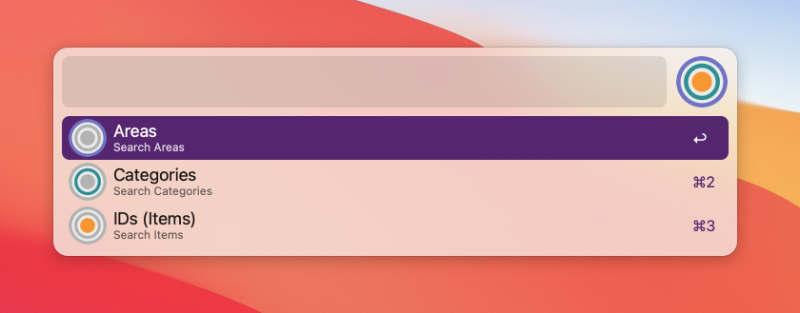

# alfred-jd
An Alfred Workflow for the Johnny.Decimal filing system

This workflow provides tools for working with the brilliant [Johnny.Decimal](https://johnnydecimal.com) filing system created by John Noble. It enables you to search (default keyword: **jd**) your Johnny.Decimal tree with Alfred at any level (Area, Category or ID), showing you *all* the folders at that level.

You can also create new ID folders using the workflow (default keyword: **jdn**): choose the Category folder in which you want to add a new folder, and enter a folder name, and the workflow will prepend the next available `AC.ID` number to your folder name and create the folder for you.

The search workflow provides different ways of acting on the results, such as opening in Finder, Terminal or browsing in Alfred.

**NOTE**: This is currently alpha software. It works and I have tried to anticipate edge cases, but use with caution and make sure you have a backup!

## Requirements

The workflow requires macOS, the [Alfred Powerpack](https://www.alfredapp.com/powerpack/), and Alfred 4.0 or higher.

## Install

1. Download the workflow from [GitHub releases](../../releases/latest), and double click it to install in Alfred.
2. If you are using macOS Catalina or Big Sur, you will probably get a warning about 'unsigned binaries'. See the instructions [here](https://github.com/deanishe/awgo/wiki/Catalina** to fix the permissions and allow Alfred to run the Go binary. You should only have to do this once.

**NOTE**: Before you try running the workflow for the first time, check whether you have the option 'Show latest query if within 5 minutes' in Alfred's Preferences > Advanced window checked. If so, uncheck it before trying to run the workflow for the first time. If you don't, the warning message about permissions will block you from running any other command in Alfred until you have fixed the permissions. You can safely re-enable the option again after fixing permissions.

## Setup

The final step in setting things up is to select this workflow in the sidebar of Alfred's preferences (under 'Workflows'), and then click the '[X]' button in the top right of the window to open the 'Configure workflow and variables' window. Follow the instructions here to enter the path to your Johnny.Decimal root folder for the 'JD_DIR' variable, so that the workflow knows where to start looking for your Johnny.Decimal filing system.

## Update

In progress...

## Contributing

If you find a bug or have ideas for feature requests, please submit an [issue](../../issues/).

## Thank you

Huge thanks to [John Noble](https://johnnydecimal.com/) for creating such an elegant method of filing!

Thanks also to Dean Jackson, whose [awgo](https://github.com/deanishe/awgo) package makes developing Go-based Alfred workflows a delight, and to Nikita Voloboev, whose [tutorial](https://medium.com/@nikitavoloboev/writing-alfred-workflows-in-go-2a44f62dc432) on using `awgo` and workflows were really useful in getting started.

